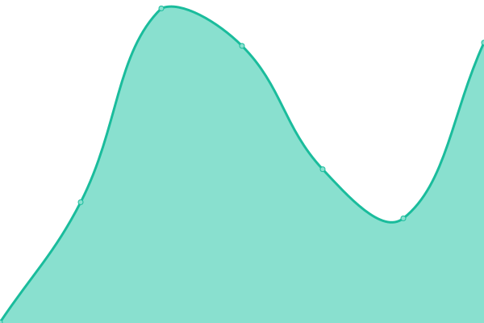
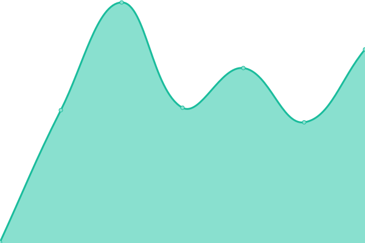
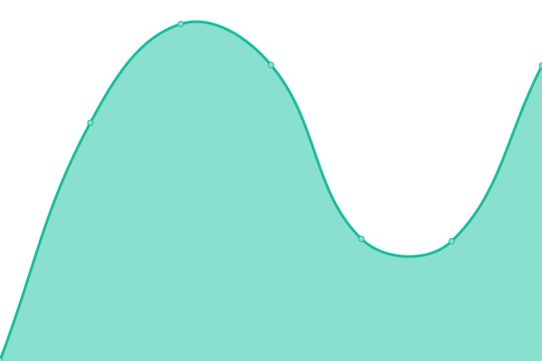
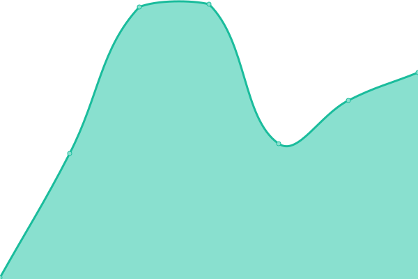
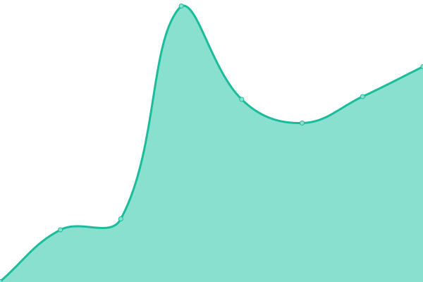
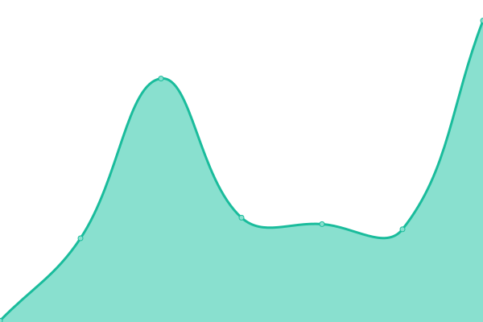
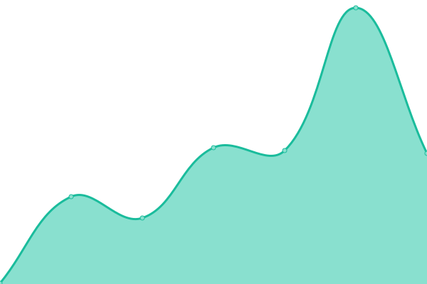
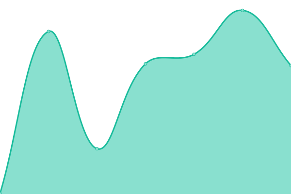

# [📈 Live Status](https://demo.upptime.js.org): <!--live status--> **🟩 All systems operational**

This repository contains the open-source uptime monitor and status page for [Upptime](https://upptime.js.org), powered by [Upptime](https://github.com/upptime/upptime).

With [Upptime](https://upptime.js.org), you can get your own unlimited and free uptime monitor and status page, powered entirely by a GitHub repository. We use [Issues](https://github.com/upptime/upptime/issues) as incident reports, [Actions](https://github.com/javdl/status.joostvanderlaan.nl/actions) as uptime monitors, and [Pages](https://demo.upptime.js.org) for the status page.

<!--start: status pages-->
<!-- This summary is generated by Upptime (https://github.com/upptime/upptime) -->
<!-- Do not edit this manually, your changes will be overwritten -->
<!-- prettier-ignore -->
| URL | Status | History | Response Time | Uptime |
| --- | ------ | ------- | ------------- | ------ |
|  [Joostvanderlaan.nl](https://www.joostvanderlaan.nl) | 🟩 Up | [joostvanderlaan-nl.yml](https://github.com/javdl/status.joostvanderlaan.nl/commits/HEAD/history/joostvanderlaan-nl.yml) | 

 546ms
     
 | 

<a href="https://status.joostvanderlaan.nl/history/joostvanderlaan-nl">100.00%</a>
    

|  [Joostvanderlaan.nl redirect](https://joostvanderlaan.nl) | 🟩 Up | [joostvanderlaan-nl-redirect.yml](https://github.com/javdl/status.joostvanderlaan.nl/commits/HEAD/history/joostvanderlaan-nl-redirect.yml) | 

 427ms
     
 | 

<a href="https://status.joostvanderlaan.nl/history/joostvanderlaan-nl-redirect">100.00%</a>
    

|  [saas.joostvanderlaan.nl](https://saas.joostvanderlaan.nl) | 🟩 Up | [saas-joostvanderlaan-nl.yml](https://github.com/javdl/status.joostvanderlaan.nl/commits/HEAD/history/saas-joostvanderlaan-nl.yml) | 

 675ms
     
 | 

<a href="https://status.joostvanderlaan.nl/history/saas-joostvanderlaan-nl">100.00%</a>
    

|  [deno-astro.joostvanderlaan.nl](https://deno-astro.joostvanderlaan.nl) | 🟩 Up | [deno-astro-joostvanderlaan-nl.yml](https://github.com/javdl/status.joostvanderlaan.nl/commits/HEAD/history/deno-astro-joostvanderlaan-nl.yml) | 

 241ms
     
 | 

<a href="https://status.joostvanderlaan.nl/history/deno-astro-joostvanderlaan-nl">100.00%</a>
    

|  [jlnw.nl](https://jlnw.nl) | 🟩 Up | [jlnw-nl.yml](https://github.com/javdl/status.joostvanderlaan.nl/commits/HEAD/history/jlnw-nl.yml) | 

 499ms
     
 | 

<a href="https://status.joostvanderlaan.nl/history/jlnw-nl">100.00%</a>
    

|  [fashionunited.com](https://fashionunited.com) | 🟩 Up | [fashionunited-com.yml](https://github.com/javdl/status.joostvanderlaan.nl/commits/HEAD/history/fashionunited-com.yml) | 

 174ms
     
 | 

<a href="https://status.joostvanderlaan.nl/history/fashionunited-com">100.00%</a>
    

|  [developer.fashionunited.com](https://developer.fashionunited.com) | 🟩 Up | [developer-fashionunited-com.yml](https://github.com/javdl/status.joostvanderlaan.nl/commits/HEAD/history/developer-fashionunited-com.yml) | 

 193ms
     
 | 

<a href="https://status.joostvanderlaan.nl/history/developer-fashionunited-com">100.00%</a>
    

|  [Google](https://www.google.com) | 🟩 Up | [google.yml](https://github.com/javdl/status.joostvanderlaan.nl/commits/HEAD/history/google.yml) | 

 99ms
     
 | 

<a href="https://status.joostvanderlaan.nl/history/google">100.00%</a>
    

|  [Wikipedia](https://en.wikipedia.org) | 🟩 Up | [wikipedia.yml](https://github.com/javdl/status.joostvanderlaan.nl/commits/HEAD/history/wikipedia.yml) | 

 124ms
     
 | 

<a href="https://status.joostvanderlaan.nl/history/wikipedia">100.00%</a>
    

|  [Hacker News](https://news.ycombinator.com) | 🟩 Up | [hacker-news.yml](https://github.com/javdl/status.joostvanderlaan.nl/commits/HEAD/history/hacker-news.yml) | 

 288ms
     
 | 

<a href="https://status.joostvanderlaan.nl/history/hacker-news">100.00%</a>
    

<!--end: status pages-->

[**Visit our status website →**](https://demo.upptime.js.org)

## 📄 License

- Powered by: [Upptime](https://github.com/upptime/upptime)
- Code: [MIT](./LICENSE) © [Upptime](https://upptime.js.org)
- Data in the `./history` directory: [Open Database License](https://opendatacommons.org/licenses/odbl/1-0/)

